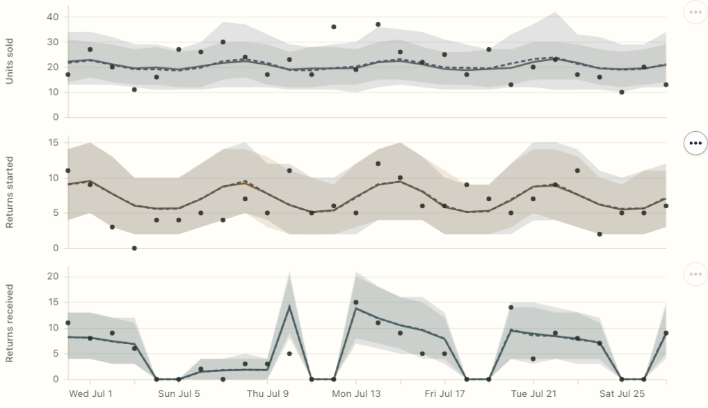

This post is a [marimo](https://marimo.io) notebook with its own layout, so it lives on its own page.

<a href="returns-forecasting.html" style="display:block; margin: 1.5rem 0;">

</a>

**[Read the post &rarr;](returns-forecasting.html)**

Warehouse receipts depend on the returns customers start this week, which depend on what sold last month and what sells this month. The post treats that as a chain of forecasts and builds it on [numpyro_forecast](https://github.com/juanitorduz/numpyro_forecast): sales is an ordinary numpyro_forecast model written with `Horizon` and `predict`, and each return stage is a time-to-event model that speaks the same protocol. One forecast call then carries sales and weather uncertainty through the whole chain, draw by draw.

The sales step is replaceable. The post fits a second, drifting local-level numpyro_forecast model and propagates its forecast through the already fitted return stages. Fitting a replacement model and overriding future scenarios are separate operations: the return stages do not need to be refitted for either forecast scenario.

The figures on the page are interactive and run in your browser: follow one purchase through its two clocks, step through the fitted chain, and switch between storm scenarios (no storm, the storm as forecast, one that lingers). Every scenario is computed ahead of time, so nothing on the page needs a server.

[ttenet](https://github.com/kylejcaron/ttenet) is the small demo package that wires the stages together: a reference implementation of the idea, meant to be read, run and adapted rather than a maintained library. The notebook behind the page is [`examples/retail_returns_blog.py`](https://github.com/kylejcaron/ttenet/blob/41565f963486507c6ed1a9aa0f7349f1b34ff70b/examples/retail_returns_blog.py). Running it refits the model and recomputes every figure:

```bash
git clone https://github.com/kylejcaron/ttenet && cd ttenet
git checkout 41565f963486507c6ed1a9aa0f7349f1b34ff70b
uv sync --all-extras
uv run marimo run examples/retail_returns_blog.py
```
